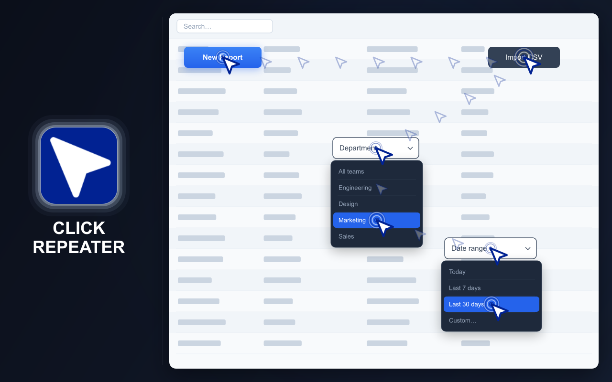
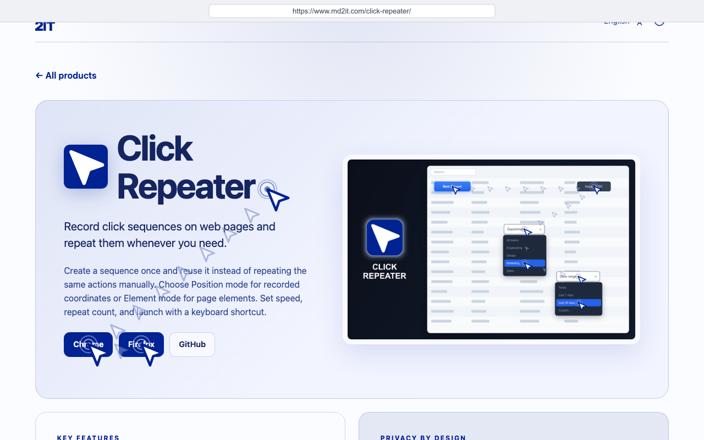
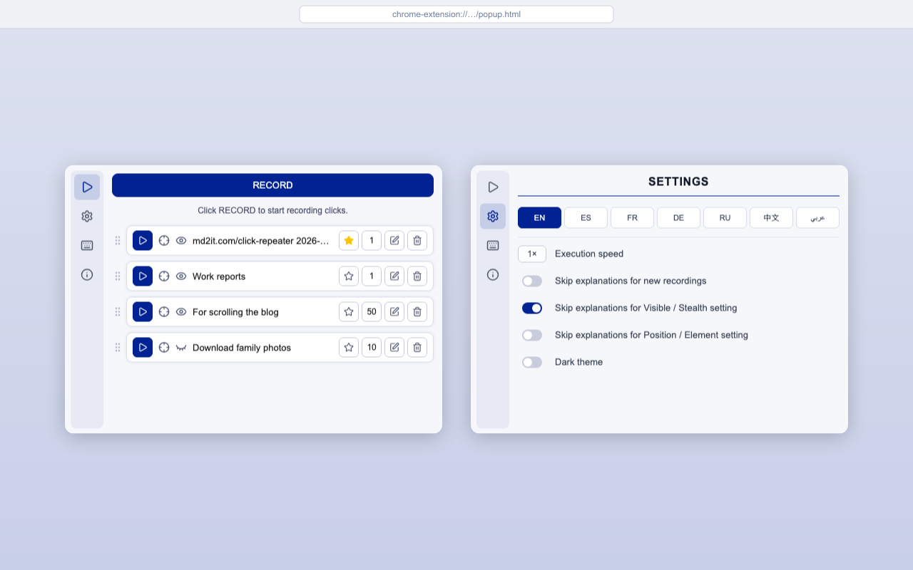
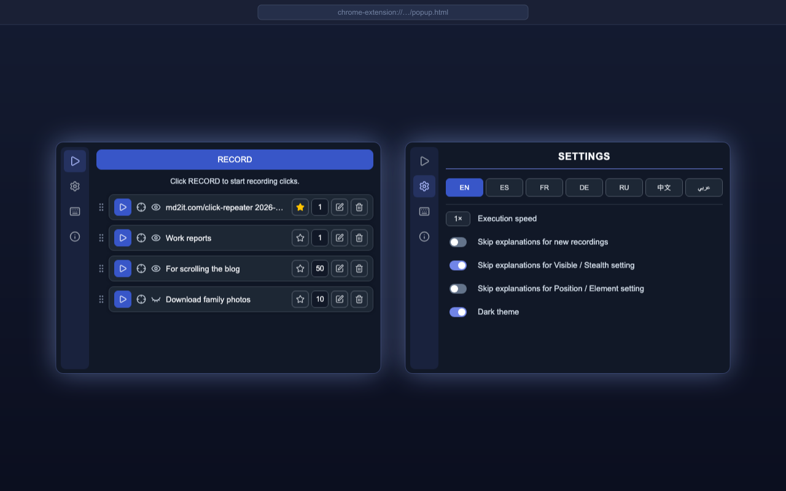

# CLICK REPEATER

  <a href="https://chromewebstore.google.com/detail/click-repeater/ojdgninjdijhhclanjlhaipehopjjmoo" target="_blank" rel="noopener noreferrer">
    <picture>
      <source media="(prefers-color-scheme: dark)" srcset="https://shieldcn.dev/badge/Chrome%20Web%20Store.svg?logo=googlechrome&logoColor=4285F4&mode=dark">
      <source media="(prefers-color-scheme: light)" srcset="https://shieldcn.dev/badge/Chrome%20Web%20Store.svg?logo=googlechrome&logoColor=4285F4&mode=light">
      
    </picture>
  </a>
  <a href="https://addons.mozilla.org/firefox/addon/click-repeater/" target="_blank" rel="noopener noreferrer">
    <picture>
      <source media="(prefers-color-scheme: dark)" srcset="https://shieldcn.dev/badge/Firefox%20Add%E2%80%91ons.svg?logo=firefoxbrowser&logoColor=FF7139&mode=dark">
      <source media="(prefers-color-scheme: light)" srcset="https://shieldcn.dev/badge/Firefox%20Add%E2%80%91ons.svg?logo=firefoxbrowser&logoColor=FF7139&mode=light">
      
    </picture>
  </a>
  <a href="https://github.com/md2it/click-repeater/releases/latest/download/click-repeater.zip">
    <picture>
      <source media="(prefers-color-scheme: dark)" srcset="https://shieldcn.dev/badge/Latest%20Release%20ZIP.svg?logo=lu:FileArchive&logoColor=CA8A04&mode=dark">
      <source media="(prefers-color-scheme: light)" srcset="https://shieldcn.dev/badge/Latest%20Release%20ZIP.svg?logo=lu:FileArchive&logoColor=CA8A04&mode=light">
      
    </picture>
  </a>

=-=-=-=-=-=-=-=-= | <a href="./docs/readmes/DE.md">DE</a> | EN | <a href="./docs/readmes/ES.md">ES</a> | <a href="./docs/readmes/FR.md">FR</a> | <a href="./docs/readmes/RU.md">RU</a> | <a href="./docs/readmes/ZH.md">中文</a> | <a href="./docs/readmes/AR.md">عربي</a> | =-=-=-=-=-=-=-=-=

## DESCRIPTION

Click Repeater records clicks and keyboard input on a web page and repeats them later.

Create an action sequence once, configure how it should run, and launch it from the extension popup or with a keyboard shortcut. Clicks can target recorded coordinates or page elements.

  
  
  
  

## KEY FEATURES

- Record click sequences on web pages
- Record and repeat keyboard input
- Run clicks in Position or Element mode
- Visible and Stealth execution
- Repeat up to 999 times
- Agile execution speed settings
- Set one as default and launch it with a shortcut
- Edit, delete, and reorder saved clicks
- Light and dark themes
- Interface available in English, French, German, Spanish, Russian, Arabic, and Simplified Chinese

## PRIVACY

- No data collection
- No tracking
- No network requests
- Clicks and settings are stored locally in the browser

## LIMITATIONS

- Browser extensions cannot operate on browser system pages or protected websites
- Element mode depends on recorded elements remaining available on the page
- Position mode depends on the relevant content remaining at the recorded coordinates
- Website changes may prevent older saved clicks from completing
- Simulated pointer movement cannot guarantee native CSS `:hover`; controls revealed only by real cursor hover may not activate
- Delete / Backspace playback does not work in Google Docs
- Keyboard input into Google Sheets cells does not work
- Simulated clicks may be detected by websites even in Stealth mode — browser-generated events lack the `isTrusted: true` flag that real user interactions carry; sites that check `event.isTrusted` will see through the automation regardless of how the click is dispatched

## LICENSE

[MIT License](./LICENSE)
