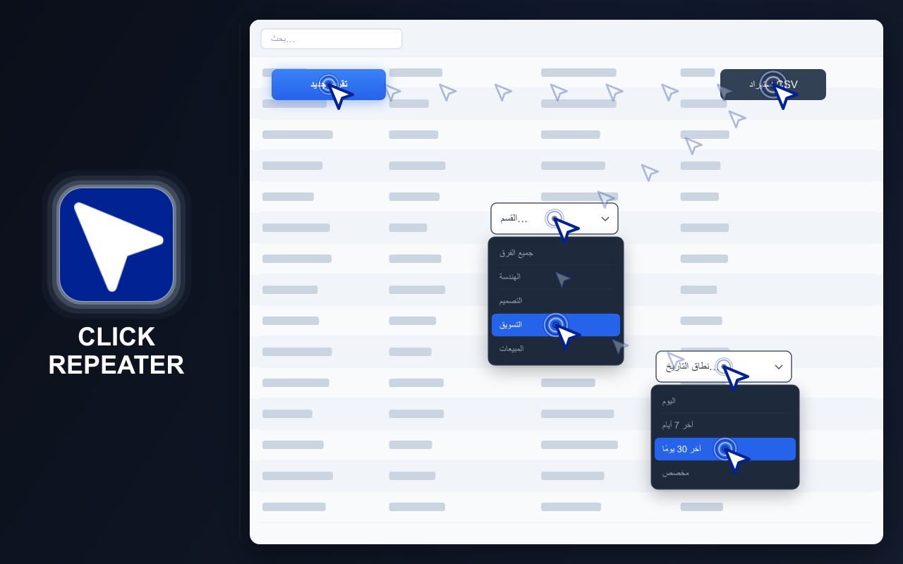
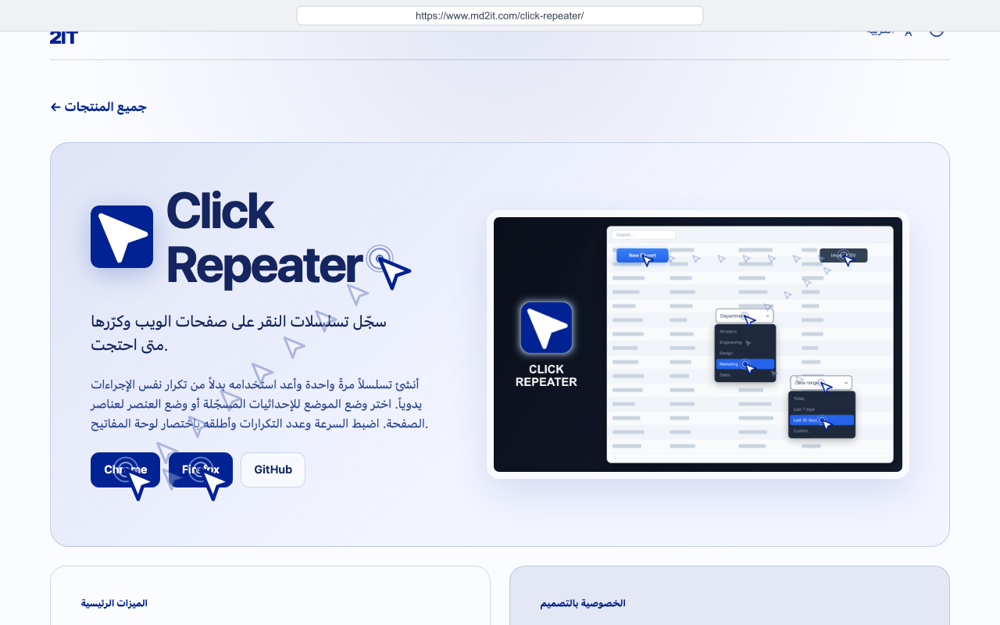
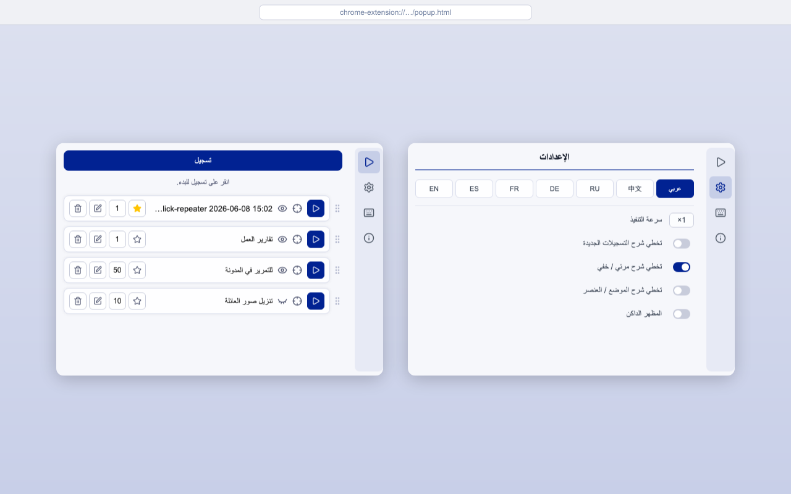
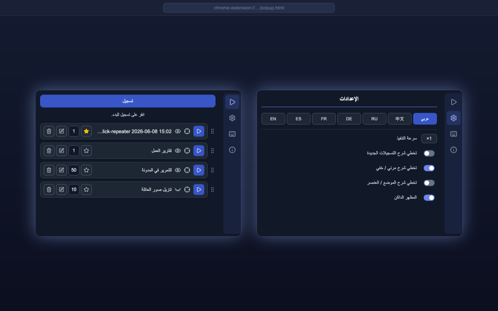

# CLICK REPEATER

=-=-=-=-=-=-=-=-= | <a href="./DE.md">DE</a> | <a href="../../README.md">EN</a> | <a href="./ES.md">ES</a> | <a href="./FR.md">FR</a> | <a href="./RU.md">RU</a> | <a href="./ZH.md">中文</a> | عربي | =-=-=-=-=-=-=-=-=

  
  
  
  

## التثبيت

### المتاجر

- [Chrome Web Store](https://chromewebstore.google.com/detail/click-repeater/ojdgninjdijhhclanjlhaipehopjjmoo)
- [Firefox Add-ons](https://addons.mozilla.org/firefox/addon/click-repeater/)

### وضع التطوير

حمّل مجلد [`extension`](../extension) بالكامل كإضافة غير مضغوطة.

## الوصف

يسجل Click Repeater النقرات وإدخال لوحة المفاتيح على صفحة ويب ويكررها لاحقًا.

أنشئ تسلسل إجراءات مرة واحدة، واضبط طريقة تشغيله، ثم شغّله من نافذة الإضافة أو باستخدام اختصار لوحة المفاتيح. يمكن للنقرات استخدام الإحداثيات المسجلة أو عناصر الصفحة.

## الميزات الرئيسية

- تسجيل تسلسلات النقر على صفحات الويب
- تسجيل إدخال لوحة المفاتيح وتكراره
- التشغيل في وضع الموضع أو العنصر
- تشغيل مرئي أو مخفي
- التكرار حتى 999 مرة
- ضبط سرعة التنفيذ
- تعيين نقرات افتراضية وتشغيلها باختصار
- تعديل النقرات المحفوظة وحذفها وترتيبها
- سمة فاتحة وأخرى داكنة

## الخصوصية

- لا يتم جمع البيانات
- لا يوجد تتبع
- لا توجد طلبات شبكة
- تُحفظ النقرات والإعدادات محليًا في المتصفح

## لغات الواجهة

- الإنجليزية
- الروسية
- الإسبانية
- الفرنسية
- الألمانية
- الصينية المبسطة
- العربية

## الاستخدام

### تسجيل النقرات

1. افتح نافذة الإضافة
2. ابدأ التسجيل
3. انقر على النقاط أو العناصر المطلوبة في الصفحة
4. انقر على أيقونة الإضافة مرة أخرى
5. سمّ النقرات واضبطها ثم احفظها

### تشغيل النقرات

1. افتح نافذة الإضافة
2. شغّل النقرات المطلوبة
3. تكرر الإضافة النقرات المسجلة وتعرض النتيجة

تؤدي نقرة المستخدم أو الضغط على `Esc` إلى إيقاف التنفيذ. يمكن أيضًا تشغيل النقرات الافتراضية باستخدام `Ctrl+Shift+X` → `M`، أو `Cmd+Shift+X` → `M` على Mac.

راجع [جميع مسارات المستخدم](../../docs/spec/user-path.md) لمزيد من التفاصيل.

## القيود

- لا تعمل إضافات المتصفح على صفحات النظام أو المواقع المحمية
- يتطلب وضع العنصر بقاء العناصر المسجلة متاحة في الصفحة
- يتطلب وضع الموضع بقاء المحتوى المطلوب عند الإحداثيات المسجلة
- قد تمنع تغييرات الموقع اكتمال النقرات المحفوظة القديمة
- لا تضمن حركة المؤشر المحاكاة تفعيل CSS `:hover` الأصلي؛ وقد لا تعمل عناصر التحكم التي تظهر فقط عند تحريك المؤشر الحقيقي فوقها
- لا يعمل تشغيل Delete / Backspace في Google Docs
- لا يعمل إدخال لوحة المفاتيح في خلايا Google Sheets
- قد تكتشف المواقع النقرات المحاكاة حتى في وضع Stealth — الأحداث التي يُنشئها المتصفح لا تحمل العلامة `isTrusted: true` التي تنفرد بها تفاعلات المستخدم الحقيقية؛ فالمواقع التي تتحقق من `event.isTrusted` ستكشف الأتمتة بصرف النظر عن طريقة إرسال النقرة

## الترخيص

[ترخيص MIT](../LICENSE)
