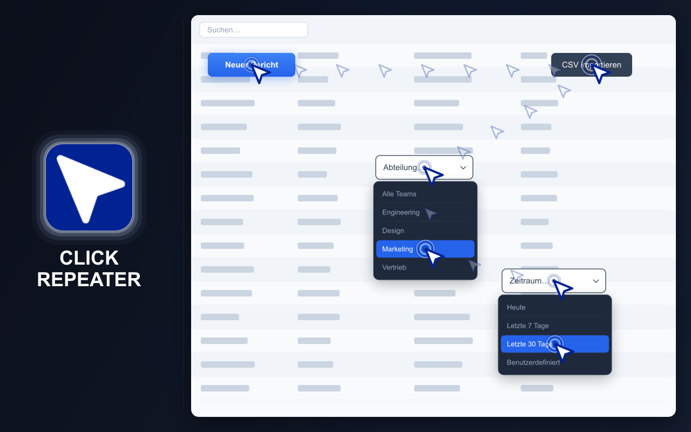
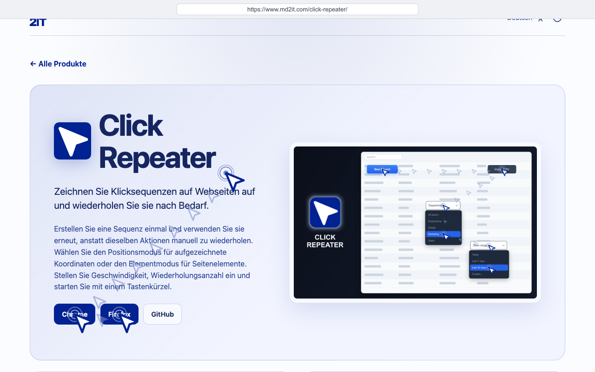
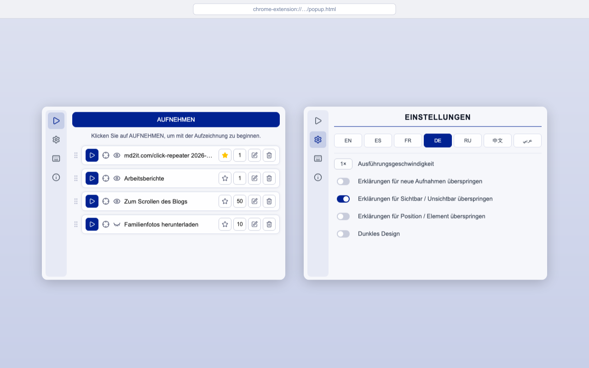
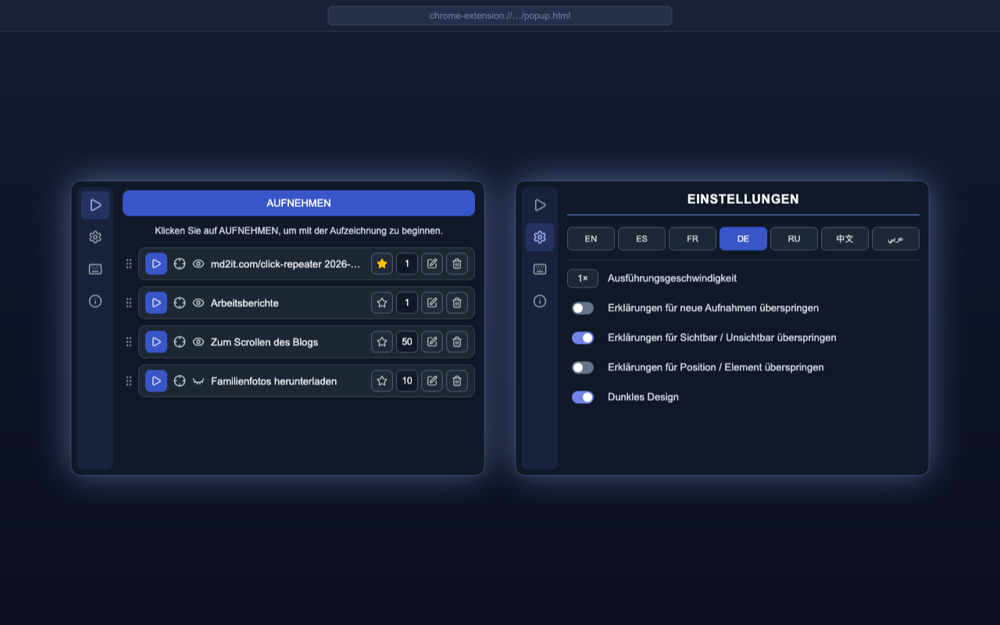

# CLICK REPEATER

  <a href="https://chromewebstore.google.com/detail/click-repeater/ojdgninjdijhhclanjlhaipehopjjmoo" target="_blank" rel="noopener noreferrer">
    <picture>
      <source media="(prefers-color-scheme: dark)" srcset="https://shieldcn.dev/badge/Chrome%20Web%20Store.svg?logo=googlechrome&logoColor=4285F4&mode=dark">
      <source media="(prefers-color-scheme: light)" srcset="https://shieldcn.dev/badge/Chrome%20Web%20Store.svg?logo=googlechrome&logoColor=4285F4&mode=light">
      
    </picture>
  </a>
  <a href="https://addons.mozilla.org/firefox/addon/click-repeater/" target="_blank" rel="noopener noreferrer">
    <picture>
      <source media="(prefers-color-scheme: dark)" srcset="https://shieldcn.dev/badge/Firefox%E2%80%91Add%E2%80%91ons.svg?logo=firefoxbrowser&logoColor=FF7139&mode=dark">
      <source media="(prefers-color-scheme: light)" srcset="https://shieldcn.dev/badge/Firefox%E2%80%91Add%E2%80%91ons.svg?logo=firefoxbrowser&logoColor=FF7139&mode=light">
      
    </picture>
  </a>
  <a href="https://github.com/md2it/click-repeater/releases/latest/download/click-repeater.zip">
    <picture>
      <source media="(prefers-color-scheme: dark)" srcset="https://shieldcn.dev/badge/Neuestes%20Release%20(ZIP).svg?logo=lu:FileArchive&logoColor=CA8A04&mode=dark">
      <source media="(prefers-color-scheme: light)" srcset="https://shieldcn.dev/badge/Neuestes%20Release%20(ZIP).svg?logo=lu:FileArchive&logoColor=CA8A04&mode=light">
      
    </picture>
  </a>

=-=-=-=-=-=-=-=-= | DE | <a href="../../README.md">EN</a> | <a href="./ES.md">ES</a> | <a href="./FR.md">FR</a> | <a href="./RU.md">RU</a> | <a href="./ZH.md">中文</a> | <a href="./AR.md">عربي</a> | =-=-=-=-=-=-=-=-=

## BESCHREIBUNG

Click Repeater zeichnet Klicks und Tastatureingaben auf einer Webseite auf und wiederholt sie später.

Erstellen Sie einmal eine Aktionsfolge, konfigurieren Sie die Ausführung und starten Sie sie über das Erweiterungsfenster oder eine Tastenkombination. Klicks können aufgezeichnete Koordinaten oder Seitenelemente verwenden.

  
  
  
  

## HAUPTFUNKTIONEN

- Klickfolgen auf Webseiten aufzeichnen
- Tastatureingaben aufzeichnen und wiederholen
- Im Positions- oder Elementmodus ausführen
- Sichtbare oder unsichtbare Ausführung
- Bis zu 999-mal wiederholen
- Einstellbare Ausführungsgeschwindigkeit
- Per Tastenkombination starten
- Gespeicherte Klicks bearbeiten, löschen und sortieren
- Helles und dunkles Design
- Oberfläche verfügbar auf Englisch, Französisch, Deutsch, Spanisch, Russisch, Arabisch und vereinfachtem Chinesisch

## DATENSCHUTZ

- Keine Datenerfassung
- Kein Tracking
- Keine Netzwerkanfragen
- Klicks und Einstellungen werden lokal im Browser gespeichert

## EINSCHRÄNKUNGEN

- Browsererweiterungen funktionieren nicht auf Systemseiten des Browsers oder geschützten Websites
- Der Elementmodus setzt voraus, dass die aufgezeichneten Elemente weiterhin auf der Seite vorhanden sind
- Der Positionsmodus setzt voraus, dass sich der relevante Inhalt weiterhin an den aufgezeichneten Koordinaten befindet
- Änderungen an einer Website können verhindern, dass ältere gespeicherte Klicks abgeschlossen werden
- Simulierte Zeigerbewegung kann natives CSS `:hover` nicht garantieren; Bedienelemente, die nur durch echten Cursor-Hover sichtbar werden, werden möglicherweise nicht aktiviert
- Die Wiedergabe von Delete / Backspace funktioniert in Google Docs nicht
- Tastatureingaben in Google-Sheets-Zellen funktionieren nicht
- Simulierte Klicks können von Websites auch im Stealth-Modus erkannt werden — browsergenerierte Ereignisse tragen nicht das Flag `isTrusted: true`, das echten Nutzerinteraktionen vorbehalten ist; Seiten, die `event.isTrusted` prüfen, erkennen die Automatisierung unabhängig davon, wie der Klick ausgelöst wurde

## LIZENZ

[MIT-Lizenz](../LICENSE)
