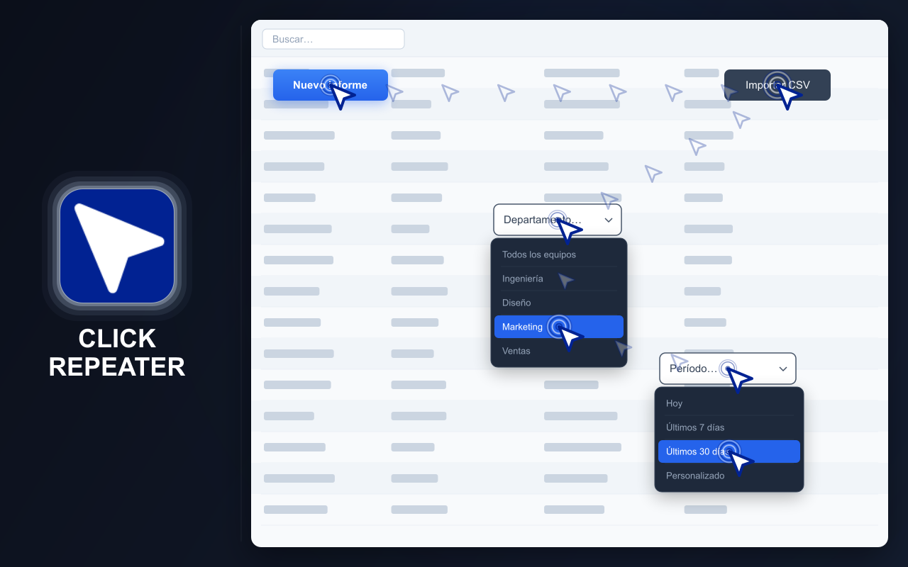
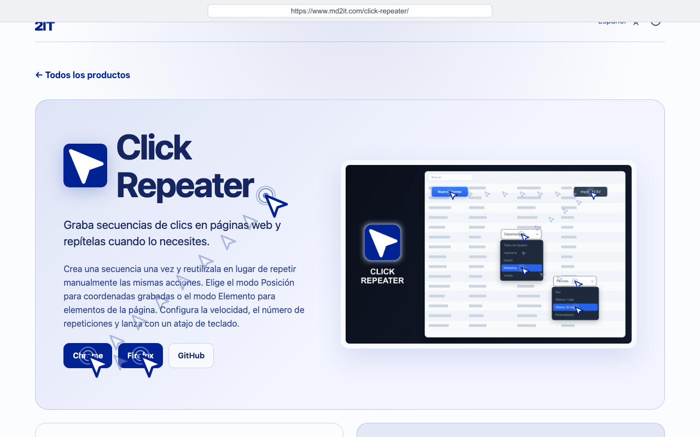
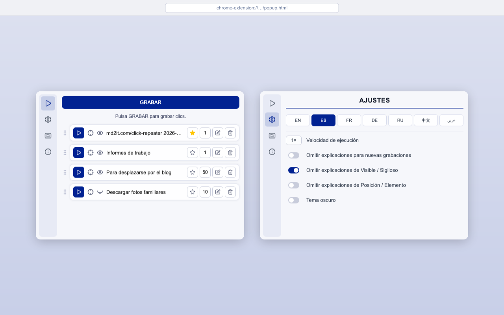
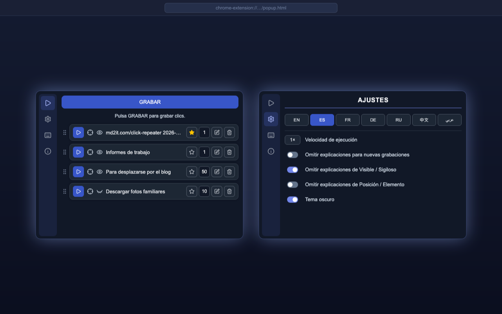

# CLICK REPEATER

  <a href="https://chromewebstore.google.com/detail/click-repeater/ojdgninjdijhhclanjlhaipehopjjmoo" target="_blank" rel="noopener noreferrer">
    <picture>
      <source media="(prefers-color-scheme: dark)" srcset="https://shieldcn.dev/badge/Chrome%20Web%20Store.svg?logo=googlechrome&logoColor=4285F4&mode=dark">
      <source media="(prefers-color-scheme: light)" srcset="https://shieldcn.dev/badge/Chrome%20Web%20Store.svg?logo=googlechrome&logoColor=4285F4&mode=light">
      
    </picture>
  </a>
  <a href="https://addons.mozilla.org/firefox/addon/click-repeater/" target="_blank" rel="noopener noreferrer">
    <picture>
      <source media="(prefers-color-scheme: dark)" srcset="https://shieldcn.dev/badge/Complementos%20de%20Firefox.svg?logo=firefoxbrowser&logoColor=FF7139&mode=dark">
      <source media="(prefers-color-scheme: light)" srcset="https://shieldcn.dev/badge/Complementos%20de%20Firefox.svg?logo=firefoxbrowser&logoColor=FF7139&mode=light">
      
    </picture>
  </a>
  <a href="https://github.com/md2it/click-repeater/releases/latest/download/click-repeater.zip">
    <picture>
      <source media="(prefers-color-scheme: dark)" srcset="https://shieldcn.dev/badge/%C3%9Altima%20versi%C3%B3n%20(ZIP).svg?logo=lu:FileArchive&logoColor=CA8A04&mode=dark">
      <source media="(prefers-color-scheme: light)" srcset="https://shieldcn.dev/badge/%C3%9Altima%20versi%C3%B3n%20(ZIP).svg?logo=lu:FileArchive&logoColor=CA8A04&mode=light">
      
    </picture>
  </a>

=-=-=-=-=-=-=-=-= | <a href="./DE.md">DE</a> | <a href="../../README.md">EN</a> | ES | <a href="./FR.md">FR</a> | <a href="./RU.md">RU</a> | <a href="./ZH.md">中文</a> | <a href="./AR.md">عربي</a> | =-=-=-=-=-=-=-=-=

## DESCRIPCIÓN

Click Repeater graba clics y entradas de teclado en una página web y los repite posteriormente.

Crea una secuencia de acciones una vez, configura cómo debe ejecutarse e iníciala desde la ventana de la extensión o con un atajo de teclado. Los clics pueden usar coordenadas grabadas o elementos de la página.

  
  
  
  

## FUNCIONES PRINCIPALES

- Grabar secuencias de clics en páginas web
- Grabar y repetir entradas de teclado
- Ejecutar en modo Posición o Elemento
- Ejecución visible o invisible
- Repetir hasta 999 veces
- Ajuste de velocidad de ejecución
- Definir una opción predeterminada e iniciarla con un atajo
- Editar, eliminar y ordenar los clics guardados
- Temas claro y oscuro
- Interfaz disponible en inglés, francés, alemán, español, ruso, árabe y chino simplificado

## PRIVACIDAD

- No se recopilan datos
- Sin seguimiento
- Sin solicitudes de red
- Los clics y los ajustes se guardan localmente en el navegador

## LIMITACIONES

- Las extensiones no funcionan en páginas del sistema del navegador ni en sitios web protegidos
- El modo Elemento requiere que los elementos grabados sigan disponibles en la página
- El modo Posición requiere que el contenido correspondiente permanezca en las coordenadas grabadas
- Los cambios en un sitio web pueden impedir que los clics guardados más antiguos se completen
- El movimiento simulado del puntero no puede garantizar el CSS `:hover` nativo; los controles que solo aparecen al pasar el cursor real pueden no activarse
- La reproducción de Delete / Backspace no funciona en Google Docs
- La entrada de teclado en celdas de Google Sheets no funciona
- Los clics simulados pueden ser detectados por los sitios web incluso en modo Stealth — los eventos generados por el navegador no tienen el indicador `isTrusted: true` que llevan las interacciones reales del usuario; los sitios que comprueban `event.isTrusted` detectarán la automatización independientemente de cómo se envíe el clic

## LICENCIA

[Licencia MIT](../LICENSE)
