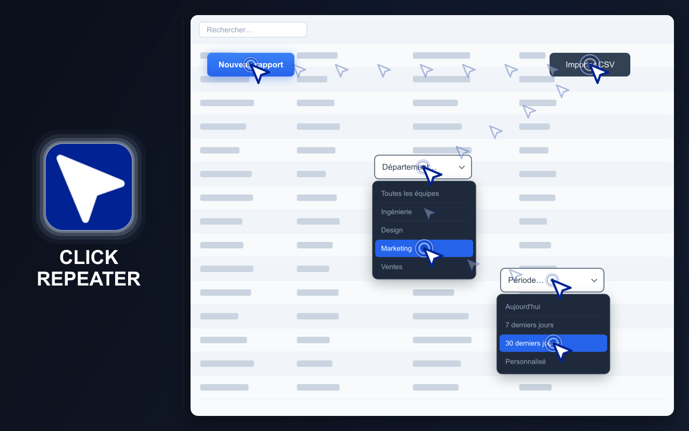
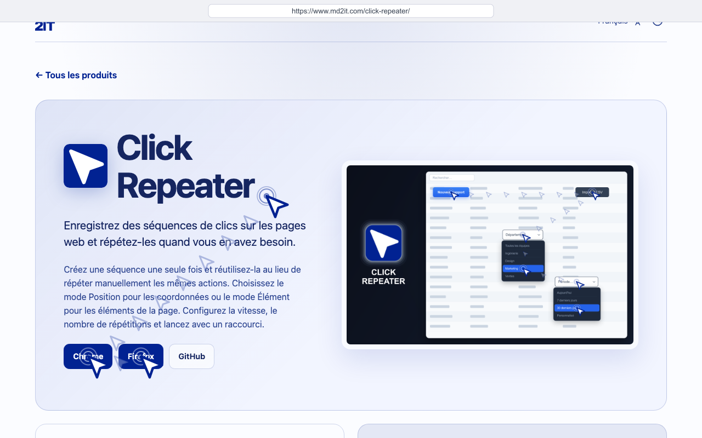
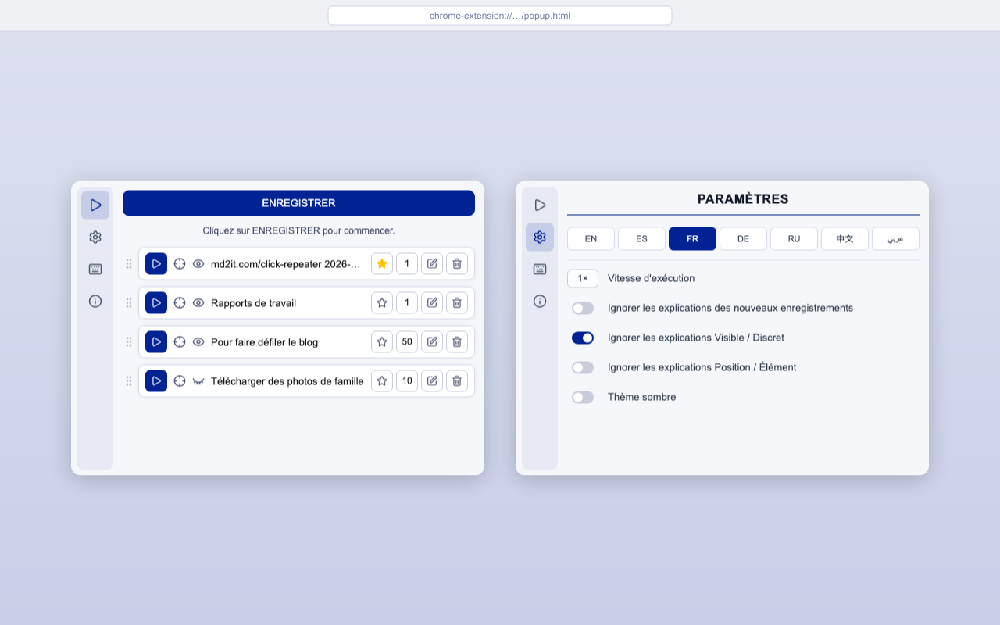
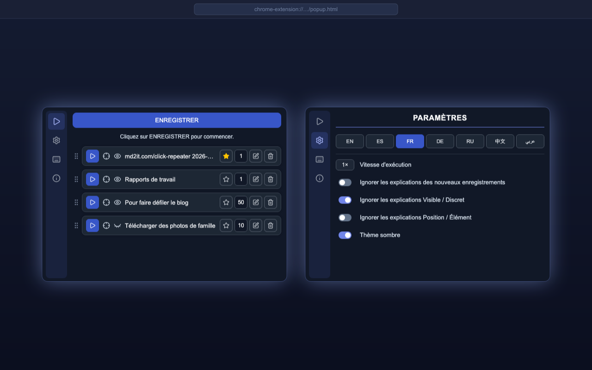

# CLICK REPEATER

  <a href="https://chromewebstore.google.com/detail/click-repeater/ojdgninjdijhhclanjlhaipehopjjmoo">
    <picture>
      <source media="(prefers-color-scheme: dark)" srcset="https://shieldcn.dev/badge/Chrome%20Web%20Store.svg?logo=googlechrome&logoColor=4285F4&mode=dark">
      <source media="(prefers-color-scheme: light)" srcset="https://shieldcn.dev/badge/Chrome%20Web%20Store.svg?logo=googlechrome&logoColor=4285F4&mode=light">
      
    </picture>
  </a>
  <a href="https://addons.mozilla.org/firefox/addon/click-repeater/">
    <picture>
      <source media="(prefers-color-scheme: dark)" srcset="https://shieldcn.dev/badge/Firefox%20Add%E2%80%91ons.svg?logo=firefoxbrowser&logoColor=FF7139&mode=dark">
      <source media="(prefers-color-scheme: light)" srcset="https://shieldcn.dev/badge/Firefox%20Add%E2%80%91ons.svg?logo=firefoxbrowser&logoColor=FF7139&mode=light">
      
    </picture>
  </a>
  <a href="https://github.com/md2it/click-repeater/releases/latest/download/click-repeater.zip">
    <picture>
      <source media="(prefers-color-scheme: dark)" srcset="https://shieldcn.dev/badge/Latest%20Release%20ZIP.svg?logo=lu:FileArchive&logoColor=CA8A04&mode=dark">
      <source media="(prefers-color-scheme: light)" srcset="https://shieldcn.dev/badge/Latest%20Release%20ZIP.svg?logo=lu:FileArchive&logoColor=CA8A04&mode=light">
      
    </picture>
  </a>

=-=-=-=-=-=-=-=-= | <a href="./DE.md">DE</a> | <a href="../../README.md">EN</a> | <a href="./ES.md">ES</a> | FR | <a href="./RU.md">RU</a> | <a href="./ZH.md">中文</a> | <a href="./AR.md">عربي</a> | =-=-=-=-=-=-=-=-=

## DESCRIPTION

Click Repeater enregistre les clics et les saisies au clavier effectués sur une page web et les répète ultérieurement.

Créez une séquence d'actions une fois, configurez son exécution et lancez-la depuis la fenêtre de l'extension ou avec un raccourci clavier. Les clics peuvent utiliser des coordonnées enregistrées ou des éléments de la page.

  
  
  
  

## FONCTIONNALITÉS PRINCIPALES

- Enregistrer des séquences de clics sur des pages web
- Enregistrer et répéter les saisies au clavier
- Exécuter en mode Position ou Élément
- Exécution visible ou invisible
- Répéter jusqu'à 999 fois
- Réglage de la vitesse d'exécution
- Définir une option par défaut et la lancer avec un raccourci
- Modifier, supprimer et réorganiser les clics enregistrés
- Thèmes clair et sombre
- Interface disponible en anglais, français, allemand, espagnol, russe, arabe et chinois simplifié

## CONFIDENTIALITÉ

- Aucune collecte de données
- Aucun suivi
- Aucune requête réseau
- Les clics et les paramètres sont enregistrés localement dans le navigateur

## LIMITATIONS

- Les extensions ne fonctionnent pas sur les pages système du navigateur ni sur les sites web protégés
- Le mode Élément nécessite que les éléments enregistrés soient toujours présents sur la page
- Le mode Position nécessite que le contenu concerné reste aux coordonnées enregistrées
- Les modifications d'un site web peuvent empêcher l'exécution complète d'anciens clics enregistrés
- Le mouvement simulé du pointeur ne peut pas garantir le CSS `:hover` natif ; les contrôles qui n'apparaissent qu'au survol réel du curseur peuvent ne pas s'activer
- La lecture de Delete / Backspace ne fonctionne pas dans Google Docs
- La saisie au clavier dans les cellules Google Sheets ne fonctionne pas
- Les clics simulés peuvent être détectés par les sites web même en mode Stealth — les événements générés par le navigateur ne portent pas l'indicateur `isTrusted: true` propre aux interactions utilisateur réelles ; les sites qui vérifient `event.isTrusted` détecteront l'automatisation quelle que soit la méthode utilisée pour déclencher le clic

## LICENCE

[Licence MIT](../LICENSE)
