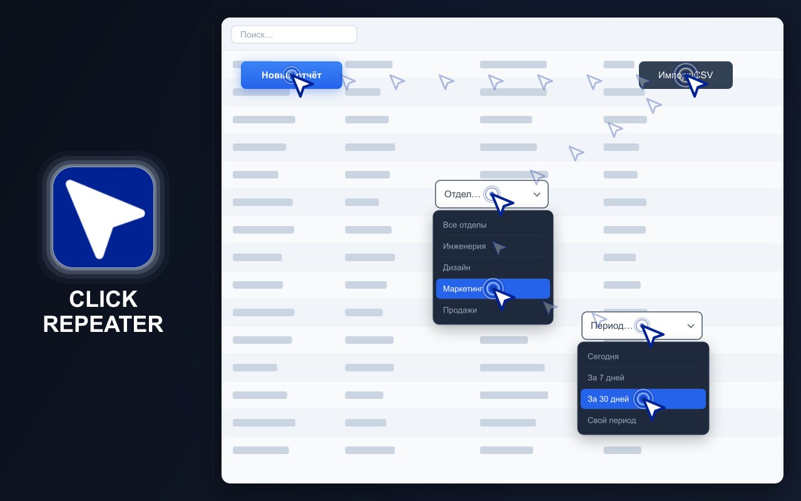
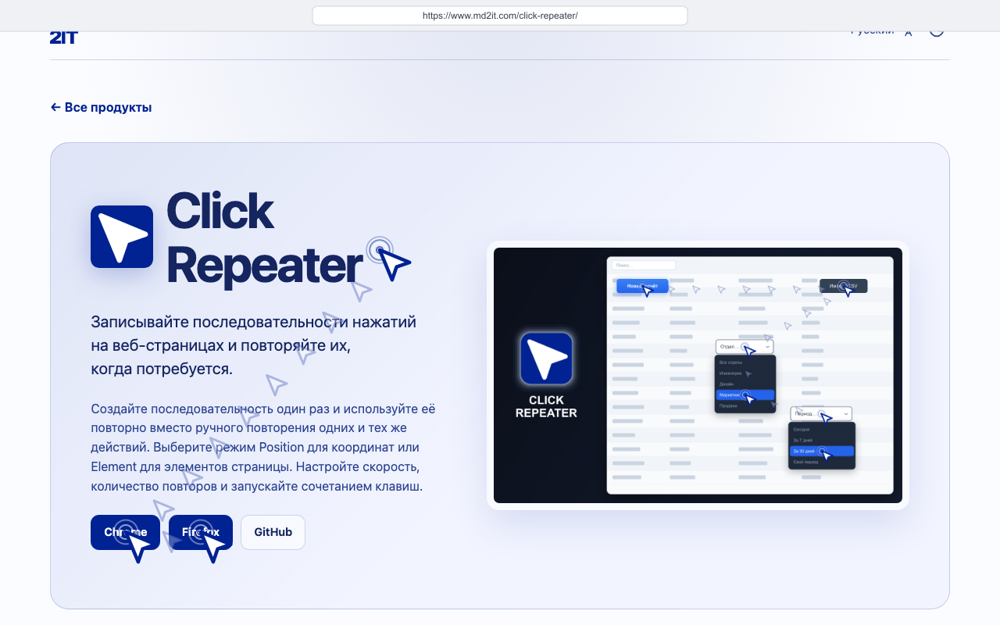
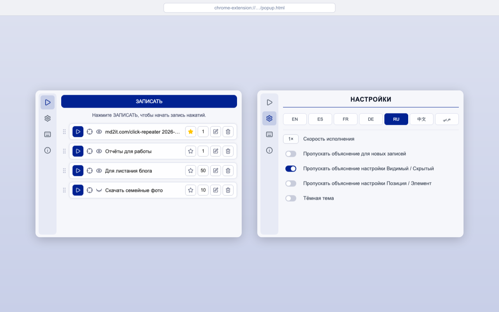
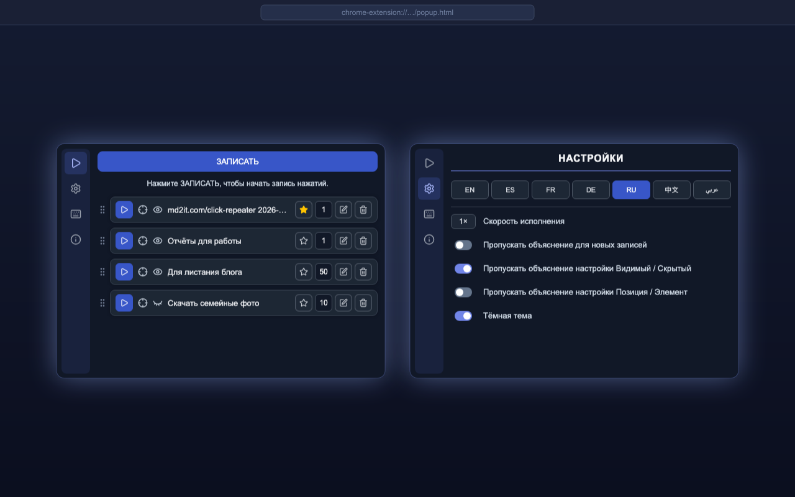

# CLICK REPEATER

  <a href="https://chromewebstore.google.com/detail/click-repeater/ojdgninjdijhhclanjlhaipehopjjmoo" target="_blank" rel="noopener noreferrer">
    <picture>
      <source media="(prefers-color-scheme: dark)" srcset="https://shieldcn.dev/badge/Chrome%20Web%20Store.svg?logo=googlechrome&logoColor=4285F4&mode=dark">
      <source media="(prefers-color-scheme: light)" srcset="https://shieldcn.dev/badge/Chrome%20Web%20Store.svg?logo=googlechrome&logoColor=4285F4&mode=light">
      
    </picture>
  </a>
  <a href="https://addons.mozilla.org/firefox/addon/click-repeater/" target="_blank" rel="noopener noreferrer">
    <picture>
      <source media="(prefers-color-scheme: dark)" srcset="https://shieldcn.dev/badge/Firefox%20Add%E2%80%91ons.svg?logo=firefoxbrowser&logoColor=FF7139&mode=dark">
      <source media="(prefers-color-scheme: light)" srcset="https://shieldcn.dev/badge/Firefox%20Add%E2%80%91ons.svg?logo=firefoxbrowser&logoColor=FF7139&mode=light">
      
    </picture>
  </a>
  <a href="https://github.com/md2it/click-repeater/releases/latest/download/click-repeater.zip">
    <picture>
      <source media="(prefers-color-scheme: dark)" srcset="https://shieldcn.dev/badge/Latest%20Release%20ZIP.svg?logo=lu:FileArchive&logoColor=CA8A04&mode=dark">
      <source media="(prefers-color-scheme: light)" srcset="https://shieldcn.dev/badge/Latest%20Release%20ZIP.svg?logo=lu:FileArchive&logoColor=CA8A04&mode=light">
      
    </picture>
  </a>

=-=-=-=-=-=-=-=-= | <a href="./DE.md">DE</a> | <a href="../../README.md">EN</a> | <a href="./ES.md">ES</a> | <a href="./FR.md">FR</a> | RU | <a href="./ZH.md">中文</a> | <a href="./AR.md">عربي</a> | =-=-=-=-=-=-=-=-=

## ОПИСАНИЕ

Click Repeater записывает нажатия и ввод с клавиатуры на веб-странице и повторяет их позже.

Один раз создайте последовательность действий, настройте выполнение и запускайте из окна расширения или сочетанием клавиш. Нажатия могут использовать записанные координаты или элементы страницы.

  
  
  
  

## КЛЮЧЕВЫЕ ВОЗМОЖНОСТИ

- Запись последовательностей нажатий на веб-страницах
- Запись и повтор ввода с клавиатуры
- Выполнение в режиме Position или Element
- Видимое или скрытое выполнение
- Повтор до 999 раз
- Настройка скорости выполнения
- Назначение по умолчанию и запуск сочетанием клавиш
- Редактирование, удаление и сортировка сохранённых нажатий
- Светлая и тёмная темы
- Интерфейс доступен на английском, французском, немецком, испанском, русском, арабском и упрощённом китайском языках

## КОНФИДЕНЦИАЛЬНОСТЬ

- Данные не собираются
- Отслеживание отсутствует
- Сетевые запросы отсутствуют
- Нажатия и настройки хранятся локально в браузере

## ОГРАНИЧЕНИЯ

- Расширения не работают на системных страницах браузера и защищённых сайтах
- В режиме Element записанные элементы должны оставаться доступными на странице
- В режиме Position нужное содержимое должно оставаться на записанных координатах
- Изменения сайта могут помешать выполнению сохранённых нажатий
- Симулированное движение указателя не гарантирует нативный CSS `:hover`; элементы управления, которые появляются только при наведении реального курсора, могут не активироваться
- Воспроизведение Delete / Backspace не работает в Google Docs
- Ввод с клавиатуры в ячейки Google Sheets не работает
- Симулированные клики могут быть обнаружены сайтами даже в режиме Stealth — события, сгенерированные браузером, не имеют флага `isTrusted: true`, который присваивается только настоящим действиям пользователя; сайты, проверяющие `event.isTrusted`, распознают автоматизацию вне зависимости от способа отправки клика

## ЛИЦЕНЗИЯ

[Лицензия MIT](../LICENSE)
