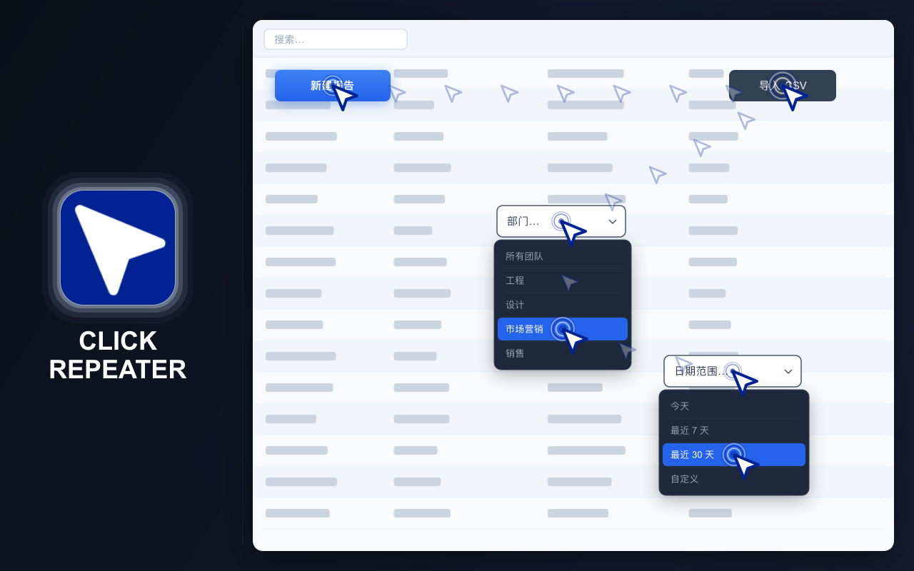
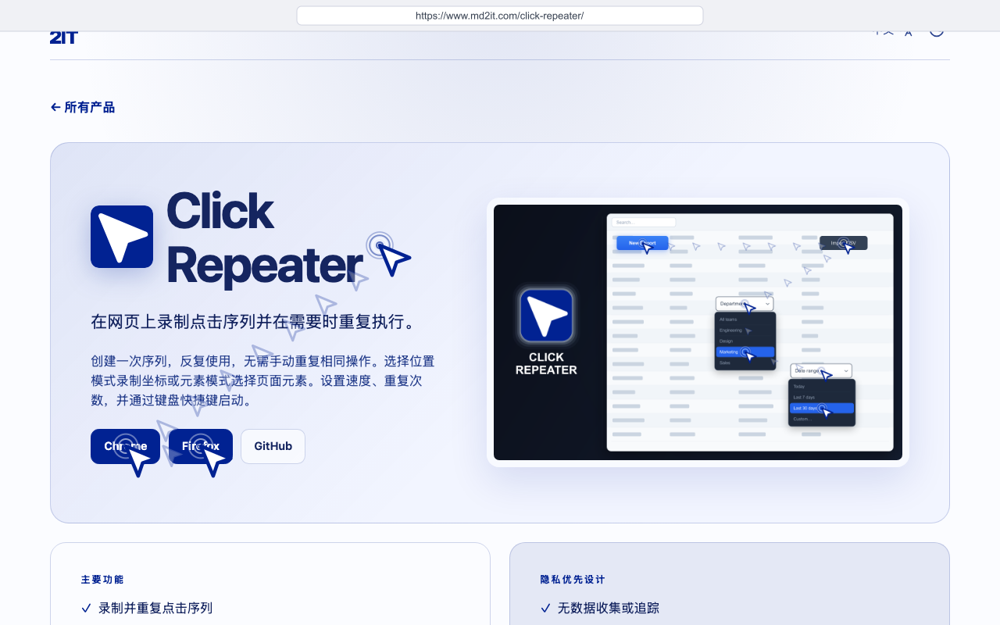
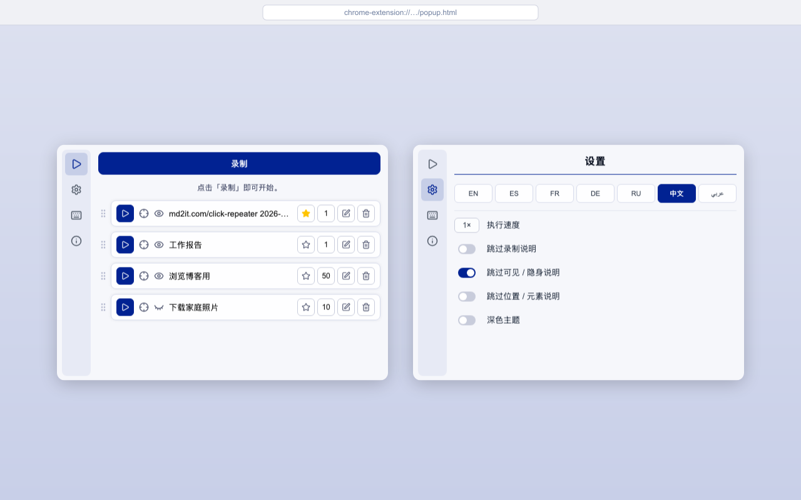
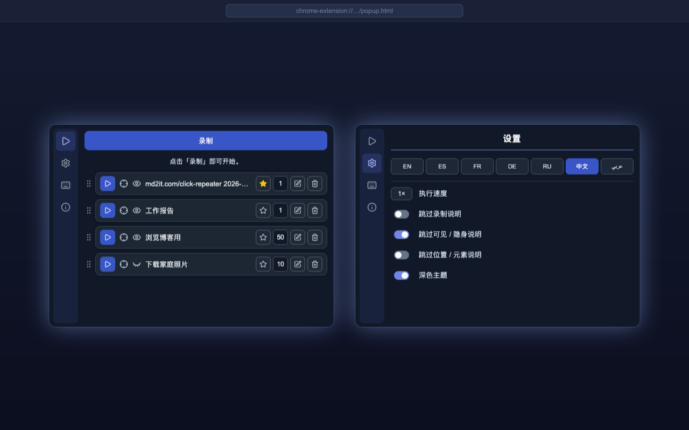

# CLICK REPEATER

  <a href="https://chromewebstore.google.com/detail/click-repeater/ojdgninjdijhhclanjlhaipehopjjmoo" target="_blank" rel="noopener noreferrer">
    <picture>
      <source media="(prefers-color-scheme: dark)" srcset="https://shieldcn.dev/badge/Chrome%20Web%20Store.svg?logo=googlechrome&logoColor=4285F4&mode=dark">
      <source media="(prefers-color-scheme: light)" srcset="https://shieldcn.dev/badge/Chrome%20Web%20Store.svg?logo=googlechrome&logoColor=4285F4&mode=light">
      
    </picture>
  </a>
  <a href="https://addons.mozilla.org/firefox/addon/click-repeater/" target="_blank" rel="noopener noreferrer">
    <picture>
      <source media="(prefers-color-scheme: dark)" srcset="https://shieldcn.dev/badge/Firefox%20Add%E2%80%91ons.svg?logo=firefoxbrowser&logoColor=FF7139&mode=dark">
      <source media="(prefers-color-scheme: light)" srcset="https://shieldcn.dev/badge/Firefox%20Add%E2%80%91ons.svg?logo=firefoxbrowser&logoColor=FF7139&mode=light">
      
    </picture>
  </a>
  <a href="https://github.com/md2it/click-repeater/releases/latest/download/click-repeater.zip">
    <picture>
      <source media="(prefers-color-scheme: dark)" srcset="https://shieldcn.dev/badge/Latest%20Release%20ZIP.svg?logo=lu:FileArchive&logoColor=CA8A04&mode=dark">
      <source media="(prefers-color-scheme: light)" srcset="https://shieldcn.dev/badge/Latest%20Release%20ZIP.svg?logo=lu:FileArchive&logoColor=CA8A04&mode=light">
      
    </picture>
  </a>

=-=-=-=-=-=-=-=-= | <a href="./DE.md">DE</a> | <a href="../../README.md">EN</a> | <a href="./ES.md">ES</a> | <a href="./FR.md">FR</a> | <a href="./RU.md">RU</a> | 中文 | <a href="./AR.md">عربي</a> | =-=-=-=-=-=-=-=-=

## 说明

Click Repeater 可以记录网页上的点击和键盘输入，并在之后重复执行。

创建一次操作序列，配置执行方式，然后通过扩展程序窗口或键盘快捷键启动。点击可以使用记录的坐标或页面元素。

  
  
  
  

## 主要功能

- 记录网页上的点击序列
- 记录并重复键盘输入
- 以位置模式或元素模式运行
- 可见或隐藏执行
- 最多重复 999 次
- 可调节的执行速度
- 设置默认点击并通过快捷键启动
- 编辑、删除和排序已保存的点击
- 浅色和深色主题
- 界面支持英语、法语、德语、西班牙语、俄语、阿拉伯语和简体中文

## 隐私

- 不收集数据
- 不跟踪用户
- 不发送网络请求
- 点击和设置仅保存在浏览器本地

## 限制

- 扩展程序无法在浏览器系统页面或受保护的网站上运行
- 元素模式要求记录的元素仍然存在于页面中
- 位置模式要求相关内容仍位于记录的坐标
- 网站更改可能导致旧的已保存点击无法完成
- 模拟指针移动不能保证触发原生 CSS `:hover`；只有真实光标悬停才显示的控件可能无法激活
- Delete / Backspace 回放在 Google Docs 中不起作用
- 无法向 Google Sheets 单元格输入键盘内容
- 即使在 Stealth 模式下，模拟点击也可能被网站检测到——浏览器生成的事件不具备真实用户交互所携带的 `isTrusted: true` 标志；检查 `event.isTrusted` 的网站无论点击以何种方式触发，都能识别出自动化行为

## 许可证

[MIT 许可证](../LICENSE)
